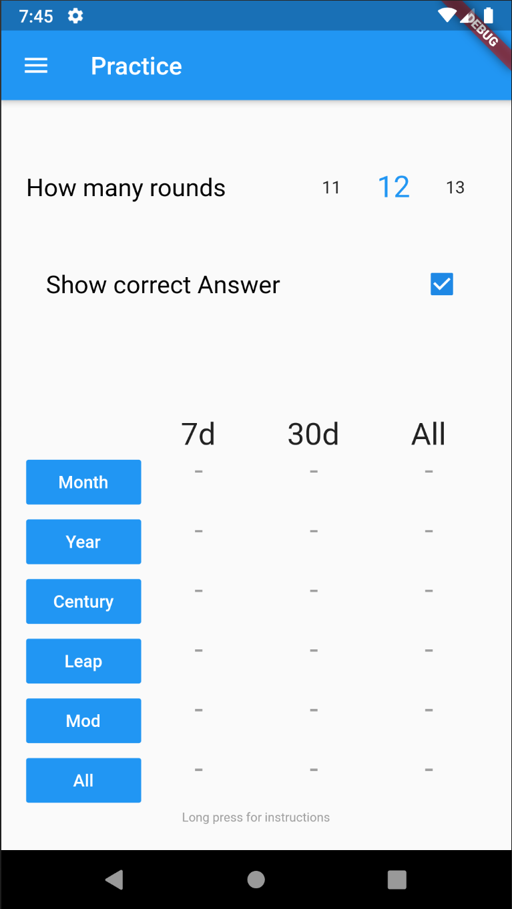
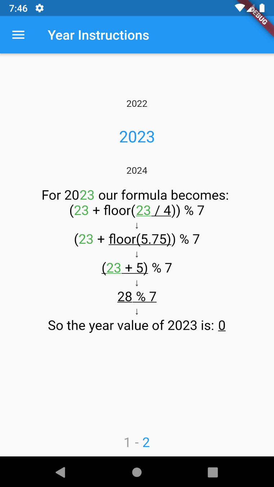
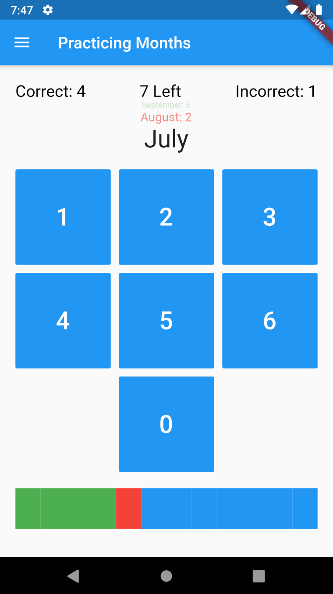

# OhThatsA 

An app to help you learn how to calculate day of the week from any date.

## App

  

Mostly made to try out Dart/Flutter.

## Method

The day of the week can be calculated by:  
`(day value + month value + year value + century value + leap year value) % 7`

Every one of these value comes from a set of constants or is calculable from the date.  
This app helps you practice memorizing and calculating these values.